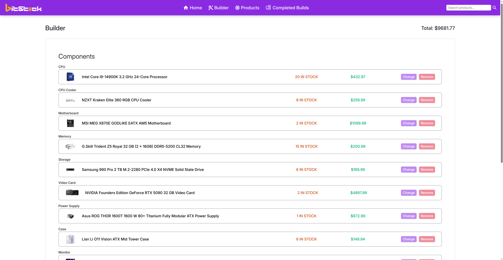

<h1 align='center'>BitStock</h1>

   

The Smart Way to Track, Stock, and Build — Your entire PC Workshop, Digitized

## Domain

## Features

- Effortless Tracking - Clean Dashboard with Up-to-date Statistics.
- Extensive Catalog - Add products across 12 Unique categories.
- Mutlifarious Filtering - Filter products by Name, Price, Quantity, Category, or Search term.
- Autonomous Crafting - Build your PC with any product from the store.
- Dedicated Pages - Build page and Product page for builds and products
- CRUD Operations - Create, Read, Update, & Delete products and builds
- Fluid Responsiveness - Dynamic layout switching for PC, Mobile, and Tablet devices

## Technologies

## Screenshots

   
    
    
   
    
    
   
    
    
   
    
    
   
    
    
   

## Project Plan

For a detailed thought process and planning behind building this project, please refer to the [Project Plan Document](./public/project-plan.md).
